<div align="center">

# NightWatch

### A real-time 3D town rendered with OpenGL, watched by a CCTV camera, and processed pixel by pixel

**Computer Graphics + Digital Image Processing in one closed-loop pipeline — written from first principles in C++17 / OpenGL 3.3, with no external assets.**


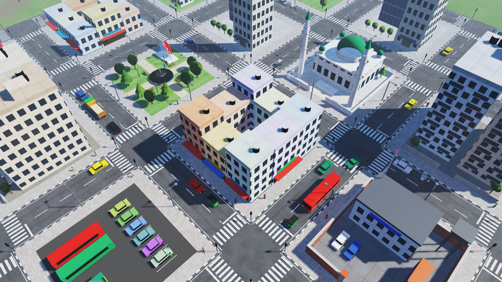

</div>

---

## Contents

- [Overview](#overview)
- [Highlights](#highlights)
- [Gallery](#gallery)
- [Architecture](#architecture)
- [Computer graphics](#computer-graphics)
- [Image processing](#image-processing)
- [Getting started](#getting-started)
- [Controls](#controls)
- [Project structure](#project-structure)
- [Documentation](#documentation)
- [Academic context](#academic-context)
- [Acknowledgements](#acknowledgements)
- [License](#license)

---

## Overview

NightWatch builds a living town procedurally — streets, buildings, traffic, and people — and renders
it with a modern forward pipeline (HDR, shadow mapping, MSAA). A CCTV camera mounted on a 4-DOF
kinematic chain watches the main junction. Its frame is captured through a framebuffer object and fed
into an image-processing stage that **degrades** it like a cheap low-light sensor, then **restores and
analyses** it.

The **Image Operation Lab** shows how a filter changes a picture, one pixel at a time. The original
image is on the left and the processed image on the right. The operation sits in the middle, under a
light source whose beams point at the pixels being read and written.

## Highlights

| | |
|---|---|
| **Procedural town** | 5 × 5 street grid, 16 themed city blocks, lane markings and zebra crossings painted in the fragment shader from world position. No textures or models. |
| **Traffic simulation** | 45 vehicles of 8 types on lane routes with **cubic Bézier** turns. Heading comes from the curve tangent `P'(t)`; vehicles obey traffic signals and keep their distance. |
| **Hierarchical people** | About 90 pedestrians with articulated skeletons and walk cycles. They wait at kerbs and cross on green. |
| **Rendering** | HDR + ACES tone mapping, camera-following shadow map with texel snapping, 4× MSAA, procedural sky, day/night cycle, Flat / Gouraud / Phong shading. |
| **Scalable lighting** | 64 street lamps and every vehicle's headlights. The nearest 16 point lights and 12 spot lights are selected per frame. |
| **Image Operation Lab** | Editable 3×3 / 5×5 kernels, median / min / max, histogram equalization, noise injection, and **PSNR** measurement, all visualised step by step. |
| **Live CCTV pipeline** | Sensor degradation (Box-Muller noise), convolution denoising, depth map, depth-of-field from the Z-buffer, Sobel edges, night vision. |

The town carries a local flavour: left-hand traffic, CNG auto-rickshaws, pedalling cycle-rickshaw
riders, a mosque, a Shaheed Minar memorial in the park, and rooftop water tanks.

## Gallery

| Night: street lamps, lit windows, headlights | Street level |
|---|---|
| 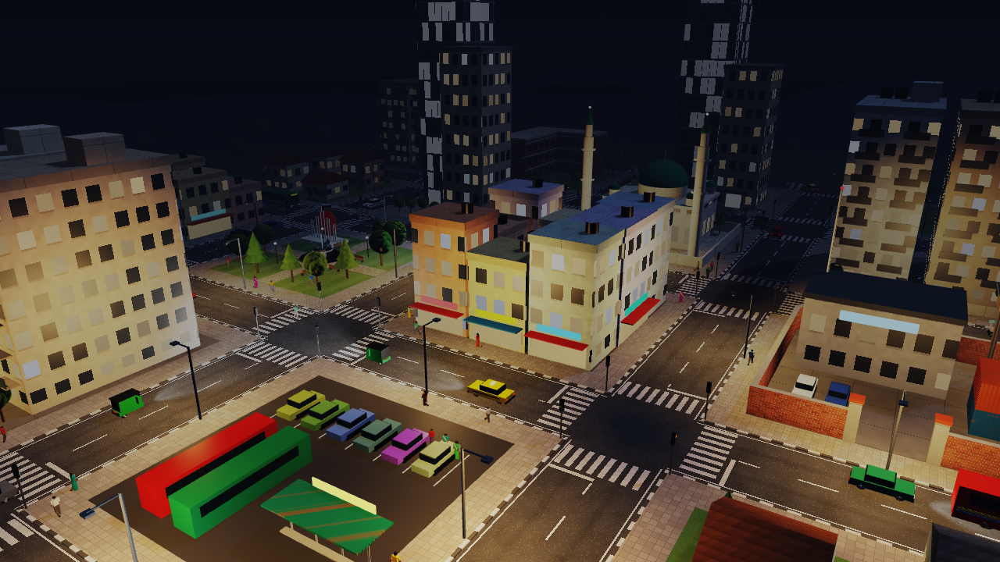 | 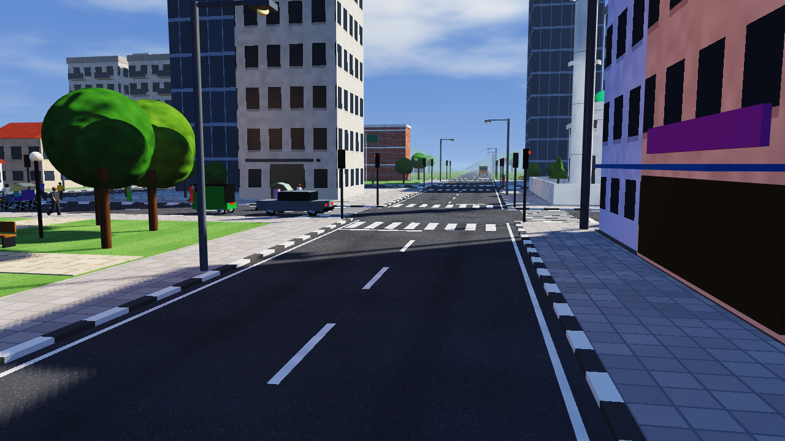 |
| **CCTV feed from the 4-DOF camera** | **Town park and junctions** |
| 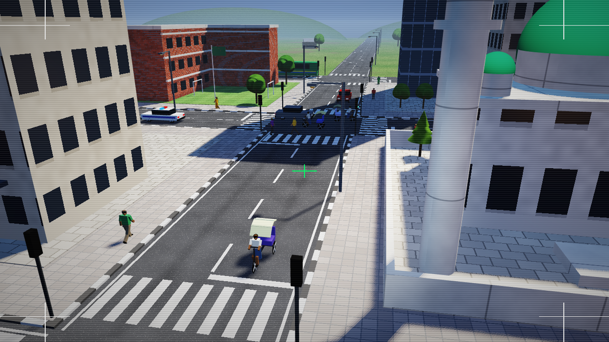 | 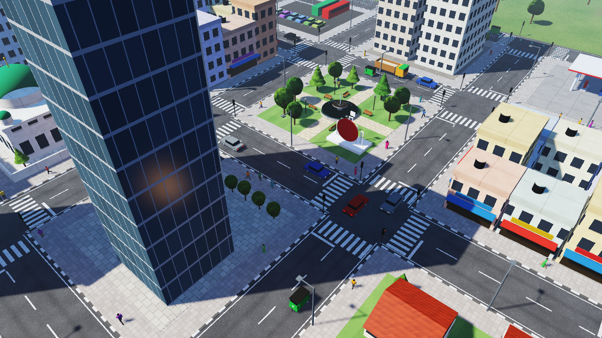 |

**Image Operation Lab — convolution.** The kernel window in the original (yellow beam) produces the
output pixel in the processed image (cyan beam). The arithmetic is shown underneath.

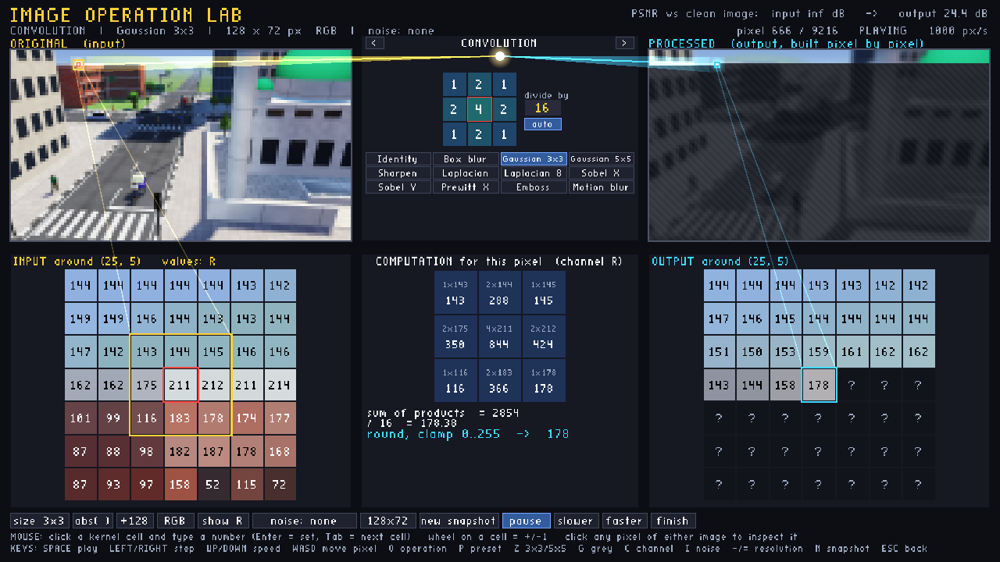

| Median filter on salt-and-pepper noise (PSNR 16.1 → 22.9 dB) | Histogram equalization (histogram, CDF, per-pixel mapping) |
|---|---|
| 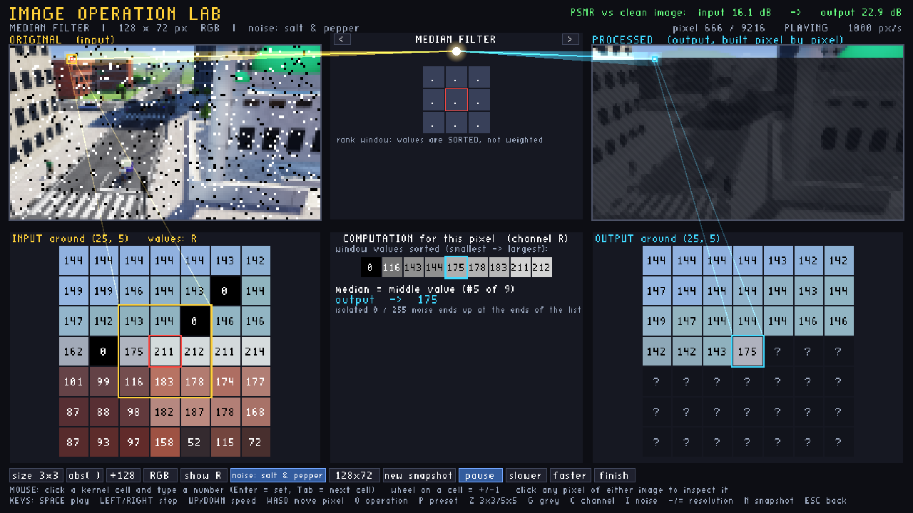 | 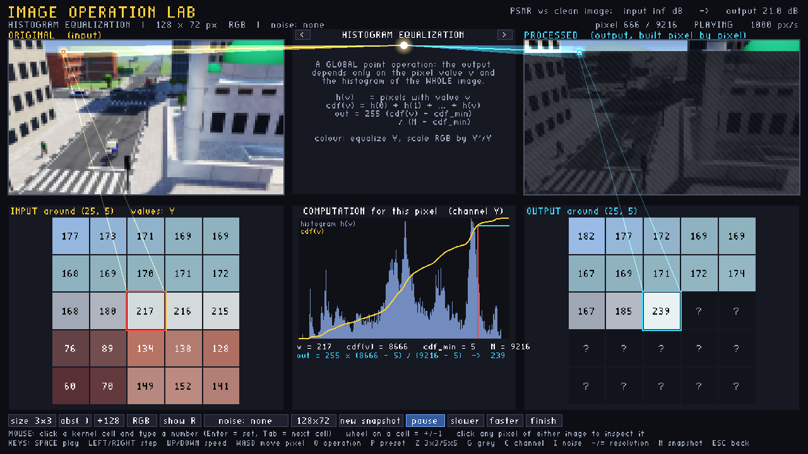 |
| **Depth of field from the depth buffer** | **Degraded vs. restored CCTV feed** |
| 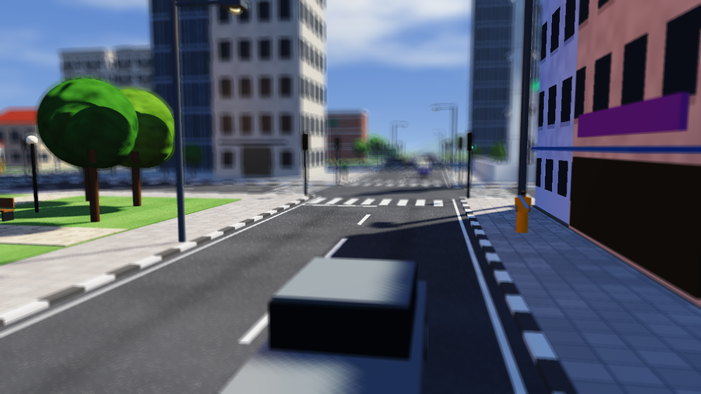 | 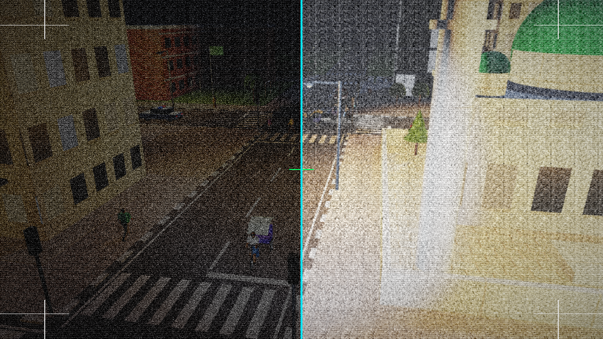 |

## Architecture

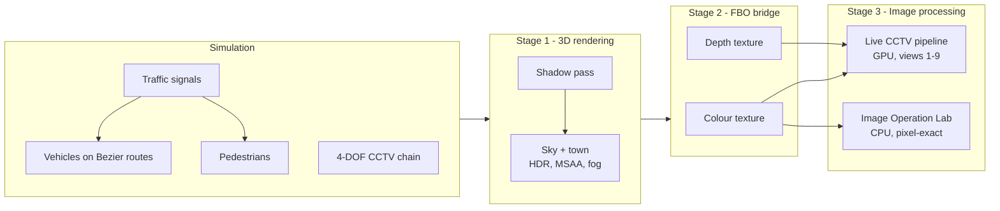

## Computer graphics

**Hierarchical kinematics.** The CCTV lens transform is a product of joint transforms:

$$\mathbf{M}_{\text{lens}} = \mathbf{M}_{\text{base}} \cdot \mathbf{R}_y(\theta_{\text{yaw}}) \cdot \mathbf{T}_{\text{arm}} \cdot \mathbf{R}_x(\theta_{\text{pitch}}) \cdot \mathbf{T}_{\text{lens}}$$

Pedestrians use the same idea: pelvis → torso → head, shoulder → elbow, and hip → knee, driven by
`swing = 0.45·sin φ`.

**Bézier motion.** Every turn on every route is a cubic Bézier curve:

$$P(t) = (1-t)^3 P_0 + 3(1-t)^2 t P_1 + 3(1-t) t^2 P_2 + t^3 P_3$$

$$P'(t) = 3(1-t)^2 (P_1 - P_0) + 6(1-t)t (P_2 - P_1) + 3t^2 (P_3 - P_2), \qquad \theta = \operatorname{atan2}(P'_x, P'_z)$$

Quarter-circle turns use handles of length $0.5523\,r$, and wheels roll by $\Delta s / r$. Press `G` to
show each turn's control polygon.

**Lighting.** The scene combines:

- hemisphere ambient light
- a shadow-mapped sun or moon
- street lamps with attenuation $I(d) = I_0 / (1 + 0.045\,d + 0.0075\,d^2)$, windowed to a finite range
- spot lights with a smooth cone falloff
- Blinn-Phong specular

Shading is computed in linear space, then passed through exposure, ACES filmic tone mapping, gamma 2.2,
and fog that matches the sky horizon.

**Traffic behaviour.**

- Vehicles stop at red.
- At yellow, a vehicle stops if it is farther than its braking distance $v^2 / 2a$.
- Vehicles follow the car ahead with $v \le v_{\text{lead}} + k\,(\text{gap} - \text{gap}_{\min})$.
- Vehicles yield to pedestrians, and brake lights glow when slowing.

## Image processing

| Operation | Formula / method |
|---|---|
| Sensor noise | Box-Muller: $Z = \sqrt{-2\ln U_1}\cos(2\pi U_2)$ |
| Convolution | $g(x,y) = \frac{1}{d}\sum_{i,j} w(i,j)\, f(x+i, y+j)$, then `abs()` / `+128` / clamp |
| Median / min / max | Rank filters over the K×K window (sorted window shown in the lab) |
| Histogram equalization | $\text{out} = \operatorname{round}\big(255\,\frac{\text{cdf}(v) - \text{cdf}_{\min}}{N - \text{cdf}_{\min}}\big)$ on luminance |
| Quality metric | $\text{PSNR} = 10 \log_{10}(255^2 / \text{MSE})$ against the noise-free image |
| Depth of field | Blur radius $R(x,y) = \alpha\,\lvert Z(x,y) - Z_{\text{focus}}\rvert$ from the linearised depth buffer |
| Edges | Sobel $G = \sqrt{G_x^2 + G_y^2}$ |

Lab presets: identity, box, Gaussian 3×3 / 5×5, sharpen, Laplacian (4- and 8-neighbour), Sobel X/Y,
Prewitt, emboss, and motion blur. You can also type any weight into any kernel cell.

## Getting started

### Prerequisites

- Windows 10/11 with an OpenGL 3.3 capable GPU
- [MinGW-w64](https://www.mingw-w64.org/) g++ with C++17 support, [CMake](https://cmake.org/) ≥ 3.15 and [Ninja](https://ninja-build.org/)
  (`build.bat` also looks in `C:\cpsetup-main\bin` and `C:\msys64\ucrt64\bin`)

GLAD and GLM are vendored in the repository. GLFW is a git submodule.

### Build and run

```bash
git clone --recursive https://github.com/k-i-mahi/Image-Graphics-Project.git
cd Image-Graphics-Project
build.bat        # configure + compile into build-mingw\
run.bat          # build if needed, then launch
```

If you cloned without `--recursive`, run `git submodule update --init` first.

The executable is `build-mingw\NightWatch.exe`. Run it from `build-mingw\` so it can find `shaders\`.

### Headless screenshot mode

The program can render a scripted frame and exit. This is useful for reports and for regression
checks:

```bash
NightWatch.exe --shot town.bmp --sim 20 --sun 55 --camera free|cctv|chase --view 1
NightWatch.exe --shot lab.bmp --camera cctv --lab --labkeys "OII^^"
```

## Controls

| Key | Action |
|---|---|
| `1` – `9` | Live views: scene, CCTV feed, degraded, enhanced, depth, depth of field, split screen, Sobel, night vision |
| `0` / `V` | Image Operation Lab |
| `C` | Camera: free fly → CCTV → chase the patrol truck |
| `W A S D Q E` + mouse | Fly the free camera |
| `[` `]` / `T` | Move the sun / automatic day-night cycle |
| `F` / `L` / `X` | Shading model / light groups / shadows |
| `G` | Patrol route with Bézier control points |
| `Space` | Pause traffic, people, and signals |
| `K` `H` `P` | Live filter / contrast stretch / CCTV auto-pan |
| `F11` / `F12` | Fullscreen / screenshot |

**In the lab:**

- **Kernel:** click a cell and type a value (`Enter`, `Tab`); the mouse wheel adds or subtracts 1.
- **Pixels:** click any pixel to inspect it, or move the inspected pixel with `WASD`.
- **Playback:** `Space` play/pause, `←` / `→` single step, `↑` / `↓` speed.
- **Options:** `O` operation, `P` preset, `Z` 3×3 / 5×5, `G` grey, `I` noise, `-` / `=` resolution.
- **Exit:** `Esc`.

## Project structure

```text
├── src/
│   ├── main.cpp            render loop, cameras, input, screenshot mode
│   ├── Town.cpp            street grid, 16 city blocks, lamps, outskirts
│   ├── TownActors.cpp      signals, vehicles, people, CCTV, fountain (hierarchical models)
│   ├── Traffic.cpp         routes, Bézier turns, signal cycle, vehicle/pedestrian behaviour
│   ├── FilterLab.cpp       Image Operation Lab
│   ├── Environment.cpp     sun, sky, fog, light selection, shadow frustum
│   └── ...                 geometry, shaders, FBO, shadow map, overlay, kinematics, camera
├── include/                headers, GLM (vendored), stb_easy_font
├── shaders/                scene, lighting, sky, shadow, dip, image, overlay (GLSL 330)
├── extern/                 GLAD (vendored), GLFW (submodule)
└── docs/                   technical notes, roadmap, changelog, proposal, screenshots
```

## Documentation

- [docs/TECHNICAL.md](docs/TECHNICAL.md) — every file, feature, and formula in detail, plus a demo script
- [docs/ROADMAP.md](docs/ROADMAP.md) — design review and roadmap
- [docs/CHANGELOG.md](docs/CHANGELOG.md) — development history
- [docs/NightWatch_Proposal.pdf](docs/NightWatch_Proposal.pdf) — original project proposal

## Academic context

Developed for **CSE 4102 — Computer Graphics and Image Processing Laboratory**, Department of Computer
Science and Engineering, **Khulna University of Engineering & Technology (KUET)**.

**Author:** Khadimul Islam Mahi · Roll 2107076 · [@k-i-mahi](https://github.com/k-i-mahi)

## Acknowledgements

- [GLFW](https://www.glfw.org/) — windowing and input (zlib licence)
- [GLAD](https://glad.dav1d.de/) — OpenGL loader
- [GLM](https://github.com/g-truc/glm) — mathematics (MIT licence)
- [stb_easy_font](https://github.com/nothings/stb) — bitmap text (public domain)

## License

Released under the [MIT License](LICENSE). Third-party libraries keep their own licences.
