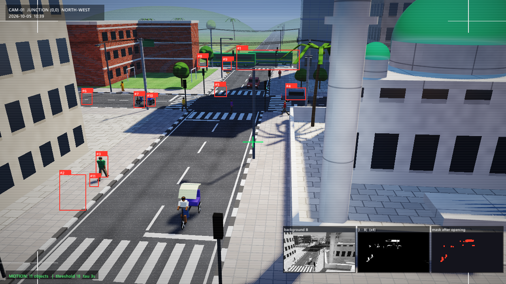
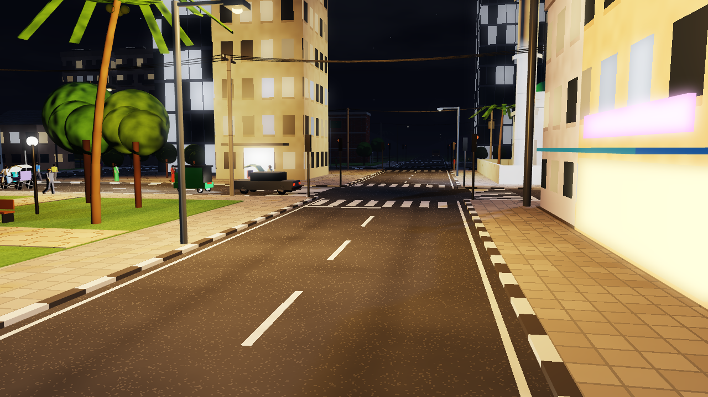
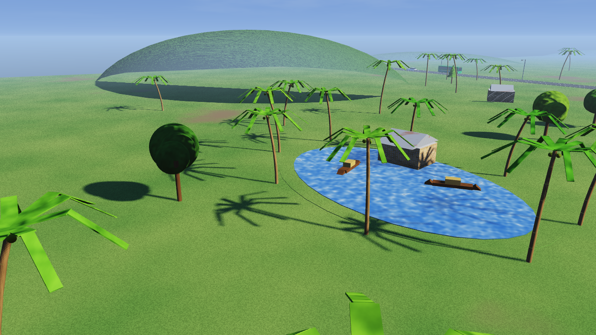
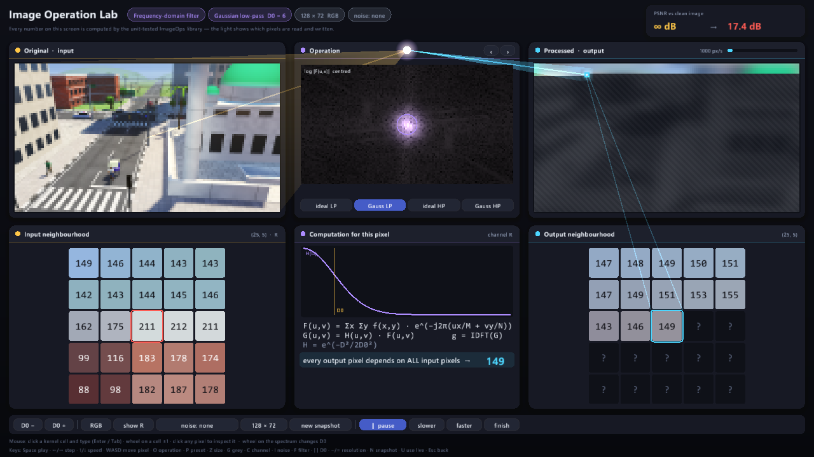
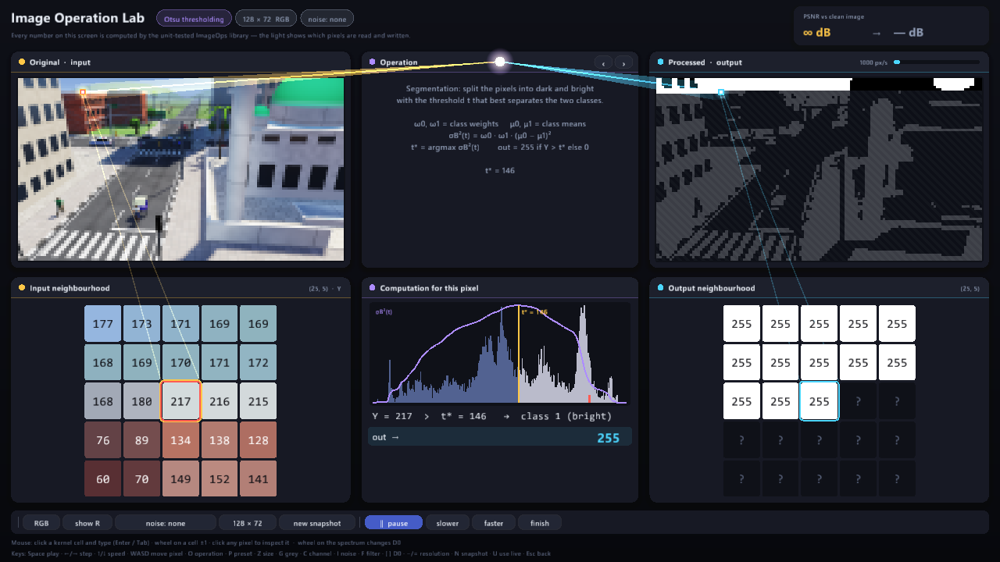
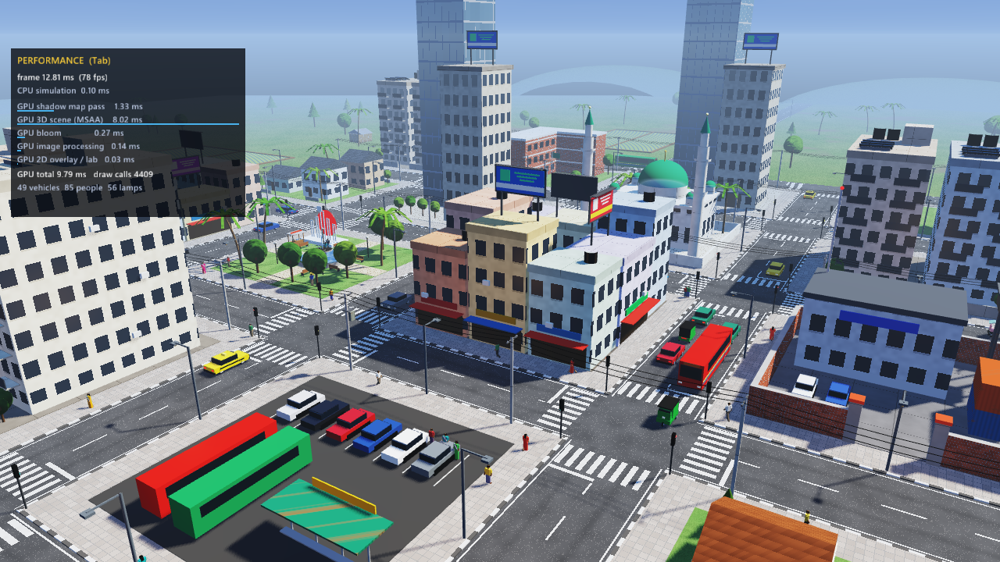
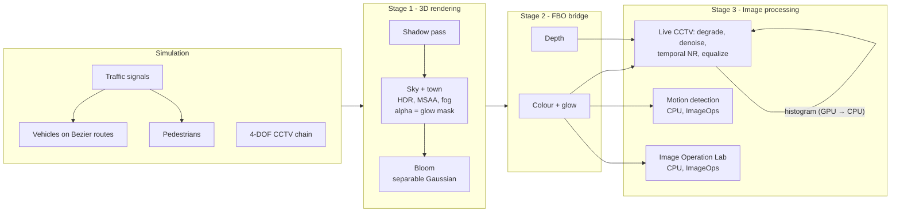

<div align="center">

# NightWatch

### A real-time 3D town rendered with OpenGL, watched by a CCTV camera that understands what it sees

**Computer Graphics + Digital Image Processing in one closed-loop pipeline — written from first principles in C++17 / OpenGL 3.3, with no external assets.**

[](https://github.com/k-i-mahi/Image-Graphics-Project/actions/workflows/build.yml)


</div>

---

## Contents

- [Overview](#overview)
- [Highlights](#highlights)
- [Gallery](#gallery)
- [Architecture](#architecture)
- [Computer graphics](#computer-graphics)
- [Image processing](#image-processing)
- [Engineering](#engineering)
- [Getting started](#getting-started)
- [Controls](#controls)
- [Project structure](#project-structure)
- [Documentation](#documentation)
- [Academic context](#academic-context)
- [License](#license)

---

## Overview

NightWatch builds a living town procedurally — streets, buildings, traffic, and people — and renders
it with a modern forward pipeline: HDR, shadow mapping, MSAA, and bloom. A CCTV camera on a 4-DOF
kinematic chain watches the main junction. Its frame is captured through a framebuffer object and
passed to an image-processing stage that does three things:

1. **Degrades** the frame like a low-light sensor.
2. **Restores** it with edge-preserving and temporal denoising plus real histogram equalization.
3. **Analyses** it, detecting and boxing moving vehicles and pedestrians.

The **Image Operation Lab** explains each operation one pixel at a time. The original image is on the
left and the processed image on the right. The operation sits in the middle, under a light source whose
beams point at the pixels being read and written. A kernel designed in the lab can be sent straight to
the live CCTV feed.

## Highlights

| | |
|---|---|
| **Procedural town** | 5 × 5 street grid, 16 themed city blocks, coconut palms, electricity poles with sagging cables, glowing rooftop billboards, tea stalls, rice paddies and a village pond. Road markings are painted in the fragment shader; there are no textures or models. |
| **Traffic simulation** | 49 vehicles of 8 types on lane routes with **cubic Bézier** turns. Heading comes from `P'(t)`; vehicles obey signals, keep their distance, and stop for people. |
| **Hierarchical people** | About 85 pedestrians with articulated skeletons and walk cycles. They wait at kerbs and cross on green. |
| **Rendering** | HDR + ACES, camera-following shadow map with texel snapping, 4× MSAA, **bloom from an emissive glow mask**, **Fresnel sky reflections** on glass, water and paint, procedural sky, day/night cycle, Flat / Gouraud / Phong shading. The static town is batched by material into a few hundred draw calls. |
| **CCTV restoration** | Bilateral, median, or kernel denoising, plus **motion-adaptive temporal noise reduction** and **real histogram equalization** driven by a GPU → CPU histogram every frame. |
| **Motion detection** | Background subtraction, thresholding, morphological opening, and connected-component labelling give bounding boxes around moving objects. The intermediate images are shown live. |
| **Image Operation Lab** | Editable 3×3 / 5×5 kernels, median / min / max, histogram equalization, **Otsu segmentation**, **frequency-domain filtering (2D DFT)**, noise injection, and **PSNR**, visualised pixel by pixel in a themed interface with real TrueType text. |
| **Measured** | A per-stage GPU timing panel (timer queries) and a unit-tested image-processing library, built by **CI** on every push. |

The town carries a local flavour: left-hand traffic, CNG auto-rickshaws, pedalling cycle-rickshaw
riders, a mosque, a Shaheed Minar memorial in the park, and rooftop water tanks.

## Gallery

**CCTV motion detection.** Each moving object gets a box. The insets show the background model $B$,
the difference $|I-B|$, and the cleaned mask.



| Street level: palms, power lines, reflections | Night: bloom on lamps, windows, neon and billboards |
|---|---|
|  |  |
| **Village pond, palms and boats** | **Town park and junctions** |
|  |  |
| **Town at night** | **Night CCTV: degraded (left) vs. restored (right)** |
|  |  |

**Image Operation Lab — convolution.** The kernel window in the original (yellow beam) produces the
output pixel in the processed image (cyan beam). The arithmetic is shown underneath.


| Frequency domain: centred spectrum, cut-off D0, H(D) curve | Otsu segmentation: histogram, σB²(t), threshold t* |
|---|---|
|  |  |
| **Median filter on salt-and-pepper noise (PSNR 16.1 → 22.9 dB)** | **Histogram equalization (histogram, CDF, per-pixel mapping)** |
|  |  |
| **Depth of field from the depth buffer** | **Performance panel (GPU time per stage)** |
|  |  |

## Architecture



## Computer graphics

**Hierarchical kinematics.** The CCTV lens transform is a product of joint transforms:

$$\mathbf{M}_{\text{lens}} = \mathbf{M}_{\text{base}} \cdot \mathbf{R}_y(\theta_{\text{yaw}}) \cdot \mathbf{T}_{\text{arm}} \cdot \mathbf{R}_x(\theta_{\text{pitch}}) \cdot \mathbf{T}_{\text{lens}}$$

Pedestrians use the same idea: pelvis → torso → head, shoulder → elbow, and hip → knee, driven by
`swing = 0.45·sin φ`.

**Bézier motion.** Every turn on every route is a cubic Bézier curve:

$$P(t) = (1-t)^3 P_0 + 3(1-t)^2 t P_1 + 3(1-t) t^2 P_2 + t^3 P_3$$

$$P'(t) = 3(1-t)^2 (P_1 - P_0) + 6(1-t)t (P_2 - P_1) + 3t^2 (P_3 - P_2), \qquad \theta = \operatorname{atan2}(P'_x, P'_z)$$

Quarter-circle turns use handles of length $0.5523\,r$, and wheels roll by $\Delta s / r$.

**Lighting.** The scene combines:

- hemisphere ambient light
- a shadow-mapped sun or moon
- the nearest 16 street lamps, with attenuation $I(d) = I_0 / (1 + 0.045\,d + 0.0075\,d^2)$
- 12 spot lights (CCTV IR and headlights)
- Blinn-Phong specular

Shading is computed in linear space, then passed through exposure, ACES filmic tone mapping, gamma 2.2,
and fog.

**Bloom.** The scene writes a *glow mask* into the alpha channel; only emitters write to it, so bright
daylight walls don't bloom. A half-resolution bright pass and three rounds of a **separable** 9-tap
Gaussian follow. Because $G(x,y) = g(x)\,g(y)$, each round costs 18 samples instead of 81. The result
is screen-blended: $c' = 1 - (1-c)(1-b)$.

## Image processing

| Operation | Formula / method | Where |
|---|---|---|
| Sensor noise | Box-Muller: $Z = \sqrt{-2\ln U_1}\cos(2\pi U_2)$ | live, lab |
| Convolution | $g(x,y) = \frac{1}{d}\sum_{i,j} w(i,j)\, f(x+i, y+j)$, then `abs()` / `+128` / clamp | live, lab |
| Median / min / max | Rank filters over the K×K window; the GPU median uses a 19-swap min/max sorting network | live, lab |
| Bilateral filter | $w = e^{-\lvert q-p\rvert^2/2\sigma_s^2}\, e^{-\lvert I_q - I_p\rvert^2/2\sigma_r^2}$ — smooths noise and keeps edges | live |
| Temporal noise reduction | $o_t = o_{t-1} + a\,(c_t - o_{t-1})$ with $a = 0.2$ on static pixels and $1$ on moving ones | live |
| Histogram equalization | $\text{out} = \operatorname{round}\big(255\,\frac{\text{cdf}(v) - \text{cdf}_{\min}}{N - \text{cdf}_{\min}}\big)$ on luminance; colour scaled by $Y'/Y$ | live, lab |
| Otsu thresholding | $t^* = \arg\max_t \sigma_B^2(t)$, $\sigma_B^2 = \omega_0\omega_1(\mu_0-\mu_1)^2$ | lab |
| Frequency-domain filtering | $F = \text{DFT}(f)$ (separable), $G = H\cdot F$, $g = \text{IDFT}(G)$; ideal / Gaussian low- and high-pass $H(D)$ | lab |
| Motion detection | $B \mathrel{+}= a(I-B)$, $M = \lvert I-B\rvert > T$, opening, 8-connected labelling (union-find) | live |
| Quality metric | $\text{PSNR} = 10 \log_{10}(255^2 / \text{MSE})$ against the noise-free image | lab |
| Depth of field | Blur radius $R(x,y) = \alpha\,\lvert Z(x,y) - Z_{\text{focus}}\rvert$ from the linearised depth buffer | live |
| Edges | Sobel $G = \sqrt{G_x^2 + G_y^2}$ | live, lab |

**Live histogram equalization, end to end:**

1. The denoised frame is rendered to a stage texture.
2. The GPU scales it down to 240 px wide.
3. The CPU reads it back, builds the luminance histogram, and computes the 256-entry lookup table with the same unit-tested function the lab uses.
4. The table is uploaded as a 256 × 1 texture and applied in the final pass.

## Engineering

- **`ImageOps`** — every image algorithm (convolution, rank filters, equalization, noise, PSNR,
  morphology, connected components) is plain C++ with no OpenGL. The lab and the motion detector call
  it, so the numbers on screen are the tested numbers.
- **Unit tests** (`tests/test_imageops.cpp`, run by `ctest`, 50 checks): hand-computed convolutions,
  Sobel clamping, emboss offset, median removing impulses, equalization edge cases, Otsu's σB² on a
  bimodal image, the DFT → IDFT round trip, PSNR, noise statistics, morphology, and component labelling
  of U-shapes and diagonals.
- **Static batching:** at startup, every static primitive sharing a material is pre-transformed into one
  vertex buffer. The whole town draws in a few hundred calls, which keeps 60 FPS with the extra detail.
- **UI:** the overlay renders TrueType fonts (Segoe UI and Consolas, rasterised once into an atlas with
  `stb_truetype`), rounded panels with soft shadows, and gradients, all in a single draw call.
- **CI** (`.github/workflows/build.yml`): on every push, GitHub Actions builds with MinGW-w64 GCC,
  runs the tests, and publishes a downloadable Windows build.
- **Measured performance:** GPU timer queries per stage, read one frame late so the CPU never stalls.
  It runs at 60 FPS (V-sync) at 1280×720.

## Getting started

### Prerequisites

- Windows 10/11 with an OpenGL 3.3 capable GPU
- [MinGW-w64](https://www.mingw-w64.org/) g++ (C++17), [CMake](https://cmake.org/) ≥ 3.15 and [Ninja](https://ninja-build.org/)

Alternatively, download a ready-to-run build from the latest
[CI run](https://github.com/k-i-mahi/Image-Graphics-Project/actions/workflows/build.yml) (artifact
`NightWatch-windows-x64`).

### Build, test and run

```bash
git clone --recursive https://github.com/k-i-mahi/Image-Graphics-Project.git
cd Image-Graphics-Project
build.bat                         # configure + compile into build-mingw\
ctest --test-dir build-mingw      # unit tests
run.bat                           # launch
```

If you cloned without `--recursive`, run `git submodule update --init` first. Run the executable from
`build-mingw\` so it finds `shaders\`.

### Headless screenshot mode

The program can render a scripted frame and exit:

```bash
NightWatch.exe --shot town.bmp --sim 20 --sun 55 --camera free|cctv|chase --view 1
NightWatch.exe --shot motion.bmp --sim 20 --camera cctv --view 2 --motion --frames 200
NightWatch.exe --shot lab.bmp --camera cctv --lab --labkeys "OII^^"
```

## Controls

| Key | Action |
|---|---|
| `1` – `9` | Live views: scene, CCTV feed, degraded, enhanced, depth, depth of field, split screen, Sobel, night vision |
| `0` / `V` | Image Operation Lab |
| `B` | Motion detection (boxes + pipeline insets) |
| `J` / `U` / `H` | Denoise: bilateral → median → kernel / temporal NR / histogram equalization |
| `K` | Live convolution kernel |
| `C` | Camera: free fly → CCTV → chase the patrol truck |
| `W A S D Q E` + mouse | Fly the free camera |
| `[` `]` / `T` | Move the sun / automatic day-night cycle |
| `F` / `L` / `X` / `Z` | Shading model / light groups / shadows / bloom |
| `G` | Patrol route with Bézier control points |
| `Space` | Pause traffic, people, and signals |
| `Tab` | Performance panel |
| `F11` / `F12` | Fullscreen / screenshot |

**In the lab:**

- **Kernel:** click a cell and type a value (`Enter`, `Tab`); the mouse wheel adds or subtracts 1. `U` sends the kernel to the live CCTV views.
- **Pixels:** click any pixel to inspect it, or move the inspected pixel with `WASD`.
- **Playback:** `Space` play/pause, `←` / `→` single step, `↑` / `↓` speed.
- **Options:** `O` operation, `P` preset, `Z` 3×3 / 5×5, `G` grey, `I` noise, `F` frequency filter type, `[` `]` cut-off D0.
- **Exit:** `Esc`.

## Project structure

```text
├── src/
│   ├── main.cpp            render loop, cameras, input, screenshot mode
│   ├── Town.cpp            street grid, 16 city blocks, lamps, outskirts
│   ├── TownActors.cpp      signals, vehicles, people, CCTV, fountain (hierarchical models)
│   ├── Traffic.cpp         routes, Bézier turns, signal cycle, vehicle/pedestrian behaviour
│   ├── ImageOps.cpp        image-processing algorithms (no OpenGL, unit-tested)
│   ├── DIPProcessor.cpp    live CCTV pipeline: two-pass equalization, denoise, temporal NR
│   ├── CctvAnalytics.cpp   motion detection + CCTV HUD
│   ├── FilterLab.cpp       Image Operation Lab
│   ├── Bloom.cpp           glow-mask bloom
│   ├── PerfStats.cpp       GPU timer queries + panel
│   └── ...                 environment, geometry, shaders, FBO, shadow map, overlay, kinematics
├── include/                headers, GLM (vendored), stb_easy_font
├── shaders/                scene, lighting, sky, shadow, dip, bloom, image, overlay (GLSL 330)
├── tests/                  ImageOps unit tests
├── extern/                 GLAD (vendored), GLFW (submodule)
├── .github/workflows/      CI: build, test, package
└── docs/                   technical notes, roadmap, changelog, proposal, screenshots
```

## Documentation

- [docs/TECHNICAL.md](docs/TECHNICAL.md) — every file, feature, and formula in detail, plus a demo script
- [docs/ROADMAP.md](docs/ROADMAP.md) — design reviews and roadmap
- [docs/CHANGELOG.md](docs/CHANGELOG.md) — development history
- [docs/NightWatch_Proposal.pdf](docs/NightWatch_Proposal.pdf) — original project proposal

## Academic context

Developed for **CSE 4102 — Computer Graphics and Image Processing Laboratory**, Department of Computer
Science and Engineering, **Khulna University of Engineering & Technology (KUET)**.

**Author:** Khadimul Islam Mahi · Roll 2107076 · [@k-i-mahi](https://github.com/k-i-mahi)

Third-party: [GLFW](https://www.glfw.org/) (zlib), [GLAD](https://glad.dav1d.de/), [GLM](https://github.com/g-truc/glm) (MIT),
[stb_truetype and stb_easy_font](https://github.com/nothings/stb) (public domain).

## License

Released under the [MIT License](LICENSE). Third-party libraries keep their own licences.
